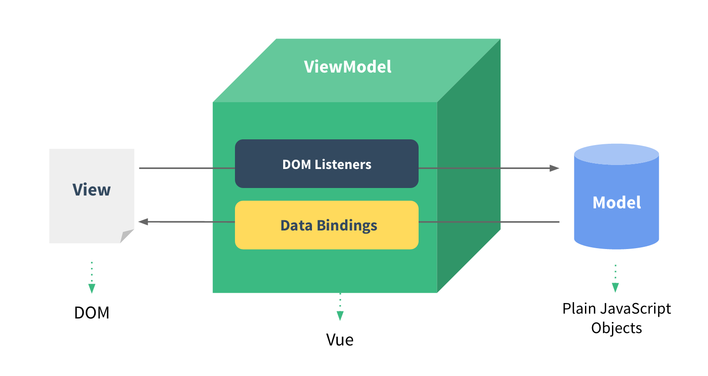

https://coding.imooc.com/class/chapter/419.html#Anchor

# Vue原理

### 组件化和MVVM

传统组件，只是静态渲染，更新还要依赖于操作DOM

数据驱动视图 - Vue MVVM

数据驱动视图 - React setState

### 响应式

组件data的数据一旦变化，立刻触发视图的更新

核心API - Object.defineProperty

Object.defineProperty的一些缺点(Vue3.0启用Proxy)

Proxy有兼容性问题，兼容性不好，无法ployfill

### VDOM和DIFF

vdom是实现vue和react的重要基石

diff算法是vdom中最核心、最关键的部分

vdom核心概念重要：h、vnode、patch、diff、key等

vdom存在的价值更加重要：数据驱动视图、控制DOM操作

#### VDOM

**背景**

DOM操作非常耗费性能

以前用jquery，可以自行控制DOM操作的时机，手动调整

Vue和React是数据驱动视图，如何有效控制DOM操作？

**解决方案-vdom**

有了一定复杂度，想减少计算次数、视图更新的次数比较难

能不能把计算，更多的转移为js计算？因为js执行速度很快

vdom - 用js模拟DOM结构，计算出最小的变更，操作DOM

用js模拟DOM结构（能模拟）

**snabbdom**

简介强大的vdom库，易学易用

vue参考它实现的vdom和diff

主要内容：vnode数据结构、h函数、patch函数

**vdom总结**

用js模拟DOM结构(vnode)

新旧vnode对比，得出最小的更新范围，最后更新DOM

数据驱动视图的模式下，有效控制DOM操作

#### DIFF

diff算法是vdom的最核心、最关键的部分

diff算法能在日常使用vue react中体现出来(如key)

**算法描述**

diff即比对，是一个广泛的概念，如linux diff命令、git diff等

两个js对象也可以做diff

两棵树做diff，如vdom diff

**难点**

树diff的时间复杂度O(n^3):

第一，遍历tree1；第二，遍历tree2

第三，排序

1000个节点，要计算1亿次，算法不可用

**优化**

优化时间复杂度到O(n)：

只比较同一层级，不跨级比较

tag不相同，则直接删掉重建，不再深度比较

tag和key，两者都相同，则认为是相同节点，不再深度比较

#### snabbdom

使用JS模拟DOM树

比较两颗虚拟DOM树的差异

将两个虚拟DOM对象的差异应用到真正的DOM树

**h**

生成模拟的DOM节点即vnode

**patch**

**patchVnode**

**addVnodes**

**removeVnodes**

**updateChildren(key的重要性)**

**使用key VS 不使用key**

### 模板编译

模板是vue开发中最常用的部分，即与使用相关联的原理

它不是html，有指令、插值、JS表达式，能够实现判断、循环

html只是标签语言，只有JS才能实现判断、循环(图灵完备的 能实现数据执行、循环和判断)

因此，模板一定是转换为某种JS代码，即编译模板

通过“组件渲染和更新过程”考察

- 前置知识：JS的[with语法](https://developer.mozilla.org/zh-CN/docs/Web/JavaScript/Reference/Statements/with)
- vue template complier将模板编译为render函数
- 执行render函数生成vnode
- 基于vnode再执行patch和diff

Vue组件中使用render代替template

### 渲染过程

一个组件渲染到页面，修改data触发更新(数据驱动视图)

**三大核心**

- 响应式：监听data属性getter setter(包括数组)
- 模板编译：模板到render函数，再到vnode
- vdom：patch(elem,vnode)和patch(anode,newVnode)

**组件渲染/更新过程**

- 初次渲染过程
  - 解析模板为render函数(或在开发环境已完成，vue-loader)
  - 触发响应式，监听data属性getter和setter
  - 执行render函数，生成vnode，patch(elem,vnode)
- 更新过程
  - 修改data，触发setter(此前在getter中已经被监听)
  - 重新执行render函数，生成newVnode
  - patch(node,newVnode)
- 异步渲染
  - 回顾$nexttick
  - 汇总data的修改，一次性更新视图
  - 减少DOM操作次数，提高性能

### 前端路由

路由模式：hash、history

**hash的特点**

hash变化会触发网页跳转，即浏览器的前进后退

hash变化不会刷新页面，SPA必需的特点

hash永远不会提交到server端(强制刷新也不会，前端自生自灭)

**H5 history**

用url规范的路由，但跳转时不刷新页面

history.pushState

window.onpopstate

需要后端支持(跳转后，再刷新页面会找不到改资源)

**选择**

to B的系统推荐使用hash，简单易用，对url规范不敏感

to C的系统，可以考虑选择H5 history，但需要服务器端支持

### 总结

#### 组件化

组件化的历史

数据驱动视图

MVVM

#### 响应式

Object.defineProperty

监听对象深度，监听数组

Object.defineProperty的缺点(Vue3.0用proxy，后面会讲)

#### vdom和diff

应用背景

vnode结构

snabbdom使用：vnode h patch

#### 模板编译

with语法

模板编译为render函数

执行render函数生成vnode

#### 组件渲染和更新过程

初次渲染

更新过程

异步渲染

#### 前端路由原理

hash 

H5 history

两者对比