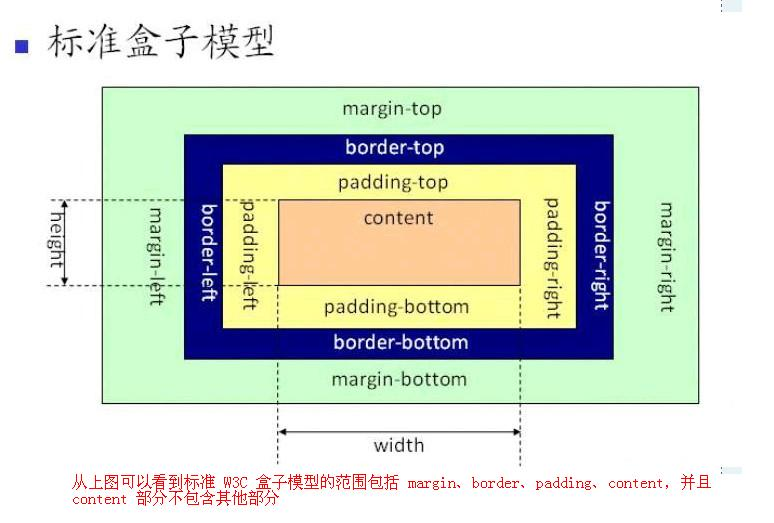

### CSS的特点

**层叠性**

在权重(优先级)相同的情况下，同一个标签的样式发生冲突，

最后定义的样式会将前面定义的样式覆盖。

**继承性**

1. 继承性，发生在有嵌套关系的元素中。

2. 在默认情况下，如果子元素没有设置样式，那么该子元素会继承父元素的中可被继承的样式。

3. 可被继承的属性：所有与文字有关的属性都会被继承。

   color,font-size,font-family,line-height,font

4. 一些特殊的标签不会受父元素字体样式的影响

   标题标签(h1~h6)的字体大小

   a标签的字体颜色

5. width 和 height 不能被继承

**优先级**

1. 继承 < 通配符选择器 < 标签选择器 < 类选择器 < ID选择器 < 行内样式 < !Important
2. 权重叠加 针对复合选择器

https://blog.csdn.net/qq_29548433/article/details/75026674

### position

### 水平垂直居中？兼容性？不知道宽高情况下？

### BFC概念？作用？常用场景？

### Flex？注意flex：1的含义，一般会给你个场景题

### 盒模型概念，如何切换盒模型？

**W3C 标准模型**

**IE模型（怪异模式）**

**box-sizing**

content-box：指定盒模型为 W3C 标准模型

border-box：指定盒模型为 IE模型（怪异模式）

### 实现1px边框？1px线条？

### 伪类和伪元素区别？使用场景？

### 重绘回流

### 清除浮动

### css选择器优先级

### 三栏布局

### 三大家族(client、offset、scroll)