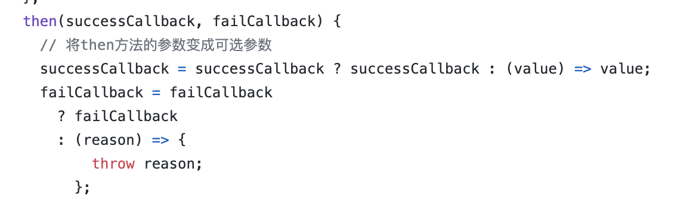

前提：了解event loop、[promise实现](https://juejin.cn/post/6945319439772434469#heading-2)

- [x] Promise的几道基础题

- [x] Promise结合setTimeout

- [x] Promise中的then、catch、finally

  ```js
  Promise.reject(1)
    .then(res => {
      console.log(res);
      return 2;
    })
    .catch(err => {
      console.log(err);
      return 3
    })
    .then(res => {
      console.log(res);
    });
  ```

  等同于（比较容易理解，打印的值为什么会传递下去，还是多看promise源码比较好理解）

  ```js
  Promise.reject(1)
    .then(res => {
      console.log(res);
      return 2;
    },(value)=>{
      console.log("then"); 
      throw value
    })
    .catch(err => {
      console.log(err);
      return 3
    })
    .then(res => {
      console.log(res);
    });
  ```

  

- [x] Promise中的all和race

- [x] async/await的几道题

  ```js
  async function async1 () {
    console.log('async1 start');
    await new Promise(resolve => {
      console.log('promise1')
      resolve()
    })
    console.log('async1 success');
    return 'async1 end'
  }
  console.log('srcipt start')
  async1().then(res => console.log(res))
  console.log('srcipt end')
  ```

  等同于

  ```js
  async function async1 () {
      return new Promise((res,rej)=>{
          console.log('async1 start');
          return Promise.resolve(new Promise(resolve => {
              console.log('promise1')
              res()
            }))
      }).then(()=>{
          console.log('async1 success');
          return 'async1 end'
      })
  
  }
  console.log('srcipt start')
  async1().then(res => console.log(res))
  console.log('srcipt end')
  ```

- [x] async处理错误

- [x] 综合题

- [x] 使用Promise实现每隔1秒输出1,2,3

- [x] 使用Promise实现红绿灯交替重复亮

- [x] 实现mergePromise函数(这个和使用Promise实现每隔1秒输出1,2,3实现思路是一样的,reduce要使用熟练)

- [x] 根据promiseA+实现一个自己的promise(这个使劲看，看了就通透了)

- [x] 封装一个异步加载图片的方法

- [ ] 限制异步操作的并发个数并尽可能快的完成全部

finally那里感觉理解还是有点问题（综合题最后一个7.3）