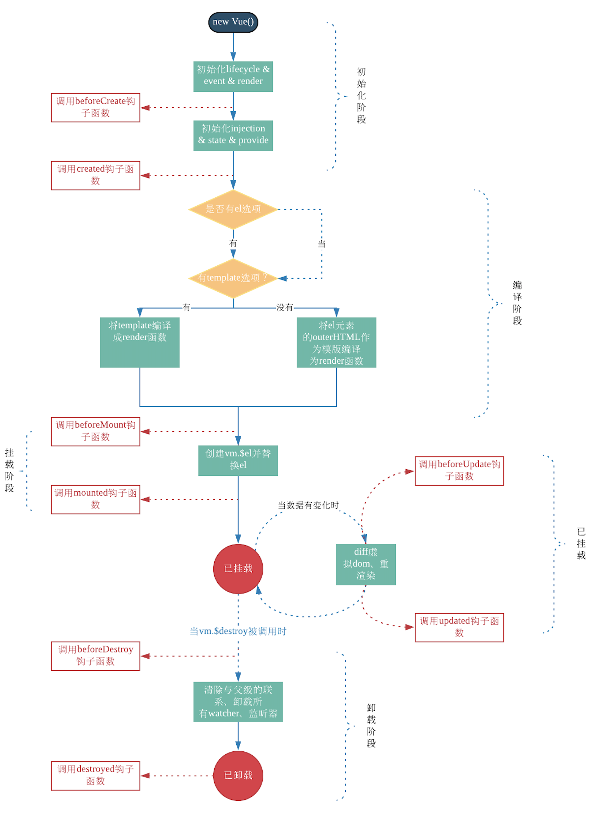

https://coding.imooc.com/class/chapter/419.html#Anchor

# VUE

### 基本使用(看下文档)

#### computed和watch

- computed有缓存，data不变则不会重新计算
- watch如何深度监听？
- watch监听引用类型，拿不到oldVal

#### class和style

#### 条件渲染

- v-if v-else的用法，可使用变量，也可以使用===表达式

- v-if和v-show(display:none,频繁变化)的区别以及使用场景

#### 循环(列表)渲染

- 如何遍历对象--也可以用v-for
- key的重要性。key不能乱写(如random或者index)
- v-for和v-if不能一起使用

#### 事件

- event参数，自定义参数

- 事件修饰符，按键修饰符

- 事件被绑定到哪里（event是原生的，事件被挂载到当前元素）

#### 表单

- v-model
- 常见表单项textarea checkbox radio select
- 修饰符lazy number trim

### 组件使用

#### 组件间通讯

父子通讯：props和$emit

兄弟通讯：自定义事件vm.$on,vm.$off,vm.$emit

#### 组件生命周期

挂载、更新、销毁阶段

created(页面还没有渲染但是vue实例初始化完成)与mounted(页面渲染完成)的区别

生命周期(父子组件,父组件先被created，然后子组件再被created，子组件mounted，父组件mounted的顺序)

### 高级特性

#### 自定义v-model

#### $nextTick

Vue是异步渲染

data改变之后，DOM不会立刻渲染

$nextTick会在DOM渲染之后被触发，以获取最新DOM节点

#### refs

#### slot

#### 动态组件

#### 异步组件

import函数

按需加载，异步加载大组件

#### keep-alive

缓存组件

频繁切换，不需要重复渲染

#### mixin

多个组件有相同的逻辑，抽离出来

mixin并不是完美的解决方案，会有一些问题：

- 变量来源不明确，不利于阅读
- 对mixin可能会造成命名冲突
- mixin和组件可能出现多对多的关系，复杂度较高

Vue3提出的Composition API旨在解决这些问题

# Vuex

面试考点不多(熟悉Vue之后，vuex没有难度)

但基本概念、基本使用和API必须要掌握

可能会考察state的数据结构设计

图重要

# Vue Router

面试考点并不多(前提是熟悉Vue)

**路由模式**

hash：http://abc.com/#/user/10

H5 history：http://abc.com/user/20（需要server端支持，因此无特殊需求可选择前者）

**路由配置**

动态路由

懒加载

# 总结

v-show和v-if的区别

为何v-for中要用key

描述Vue组件生命周期(有父子组件的情况)

Vue组件如何通讯(父子组件通讯 两个组件没有关系的通讯 vuex的通讯)

描述组件渲染和更新的过程

双向数据绑定v-model的实现原理

