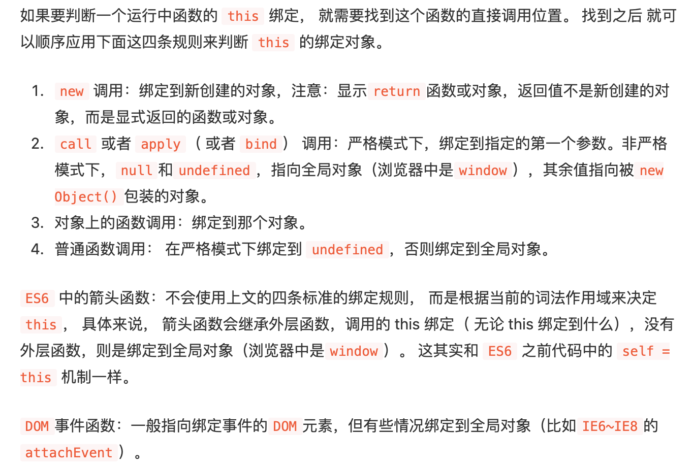
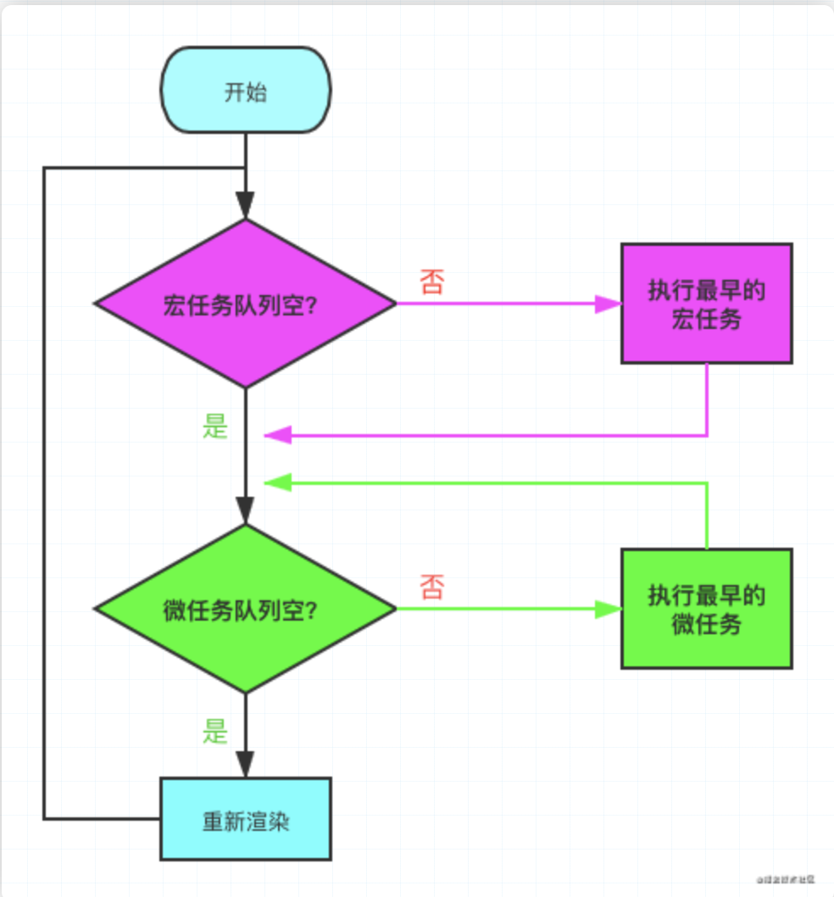
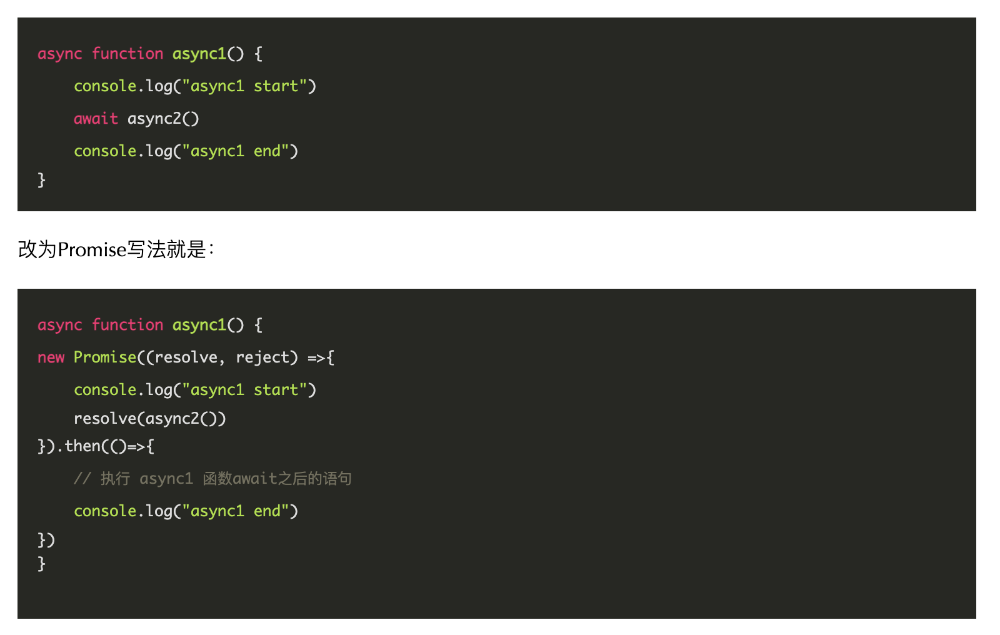

## JavaScript 基础

### 执行上下文/作用域链/闭包

- [ ] [理解 JavaScript 中的执行上下文和执行栈](https://juejin.im/post/5ba32171f265da0ab719a6d7)(这个的变量对象部分看冼羽博客的https://github.com/mqyqingfeng/Blog/issues/5比较容易理解)
- [x] [JavaScript深入之执行上下文栈](https://github.com/mqyqingfeng/Blog/issues/4)
- [ ] [一道js面试题引发的思考](https://github.com/kuitos/kuitos.github.io/issues/18)（看了冼羽的博客相关文章，这一篇可以不用看，内容差不多https://github.com/mqyqingfeng/Blog/issues/4）
- [x] [JavaScript深入之词法作用域和动态作用域](https://github.com/mqyqingfeng/Blog/issues/3)
- [x] [JavaScript深入之作用域链](https://github.com/mqyqingfeng/Blog/issues/6)
- [ ] [发现 JavaScript 中闭包的强大威力](https://juejin.im/post/5c4e6a90e51d4552266576d2)
- [ ] [JavaScript闭包的底层运行机制](http://blog.leapoahead.com/2015/09/15/js-closure/)
- [ ] [我从来不理解JavaScript闭包，直到有人这样向我解释它...](https://zhuanlan.zhihu.com/p/56490498)（pass）
- [ ] [破解前端面试（80% 应聘者不及格系列）：从闭包说起](https://juejin.im/post/58f1fa6a44d904006cf25d22#heading-0)

### this/call/apply/bind

- [ ] 过完之后刷题：[this练习题](https://juejin.cn/post/6844904083707396109)

- [ ] [JavaScript基础心法——this](https://github.com/axuebin/articles/issues/6)

- [x] [JavaScript深入之从ECMAScript规范解读this](https://github.com/mqyqingfeng/Blog/issues/7)

- [x] [前端基础进阶（七）：全方位解读this](https://www.jianshu.com/p/d647aa6d1ae6)

- [x] [面试官问：JS的this指向](https://juejin.im/post/5c0c87b35188252e8966c78a)

  

- [x] [JavaScript深入之call和apply的模拟实现](https://juejin.im/post/5907eb99570c3500582ca23c)

- [ ] [JavaScript基础心法—— call apply bind](https://github.com/axuebin/articles/issues/7)

- [ ] [面试官问：能否模拟实现JS的call和apply方法](https://juejin.im/post/5bf6c79bf265da6142738b29)

- [ ] [回味JS基础:call apply 与 bind](https://juejin.im/post/57dc97f35bbb50005e5b39bd)

- [ ] [面试官问：能否模拟实现JS的bind方法](https://juejin.im/post/5bec4183f265da616b1044d7)

- [x] [不用call和apply方法模拟实现ES5的bind方法](https://github.com/jawil/blog/issues/16)

### 原型/继承

- [ ] [深入理解 JavaScript 原型](https://mp.weixin.qq.com/s/1UDILezroK5wrcK-Z5bHOg)
- [ ] [【THE LAST TIME】一文吃透所有JS原型相关知识点](https://juejin.im/post/5dba456d518825721048bce9)(*)
- [ ] [重新认识构造函数、原型和原型链](https://juejin.im/post/5c6a9c10f265da2db87b98f3)
- [x] [JavaScript深入之从原型到原型链](https://github.com/mqyqingfeng/blog/issues/2)(这个没有交代原型出现的背景，在[JavaScript深入之创建对象的多种方式以及优缺点](https://github.com/mqyqingfeng/Blog/issues/15)这篇里面交代了)
- [ ] [最详尽的 JS 原型与原型链终极详解，没有「可能是」。（一）](https://www.jianshu.com/p/dee9f8b14771)
- [ ] [最详尽的 JS 原型与原型链终极详解，没有「可能是」。（二）](https://www.jianshu.com/p/652991a67186)
- [ ] [最详尽的 JS 原型与原型链终极详解，没有「可能是」。（三）](https://www.jianshu.com/p/a4e1e7b6f4f8)
- [ ] [JavaScript 引擎基础：原型优化](https://hijiangtao.github.io/2018/08/21/Prototypes/)
- [ ] [Prototypes in JavaScript](https://medium.com/better-programming/prototypes-in-javascript-5bba2990e04b)
- [x] [JavaScript深入之创建对象的多种方式以及优缺点](https://github.com/mqyqingfeng/Blog/issues/15)
- [ ] [详解JS原型链与继承](http://louiszhai.github.io/2015/12/15/prototypeChain/)
- [ ] [从__proto__和prototype来深入理解JS对象和原型链](https://github.com/creeperyang/blog/issues/9)
- [ ] [代码复用模式](https://github.com/jayli/javascript-patterns/blob/master/chapter6.markdown)
- [ ] [JavaScript 中的继承：ES3、ES5 和 ES6](https://juejin.cn/post/6844903543476846600)(*)
- [x] [JavaScript深入之继承的多种方式以及优缺点](https://github.com/mqyqingfeng/Blog/issues/16)

###  Promise

前提：了解promise、generator、async/await的基本使用https://es6.ruanyifeng.com/

了解async/await的前提是知道其与promise的转换关系，generator的自动执行（co）

看拉钩教程写了一版promise的源码：https://github.com/axiaoha/FE-STUDY/blob/feature/JS-IN-DEPTH-ANALYSIS/myPromise.mjs

- [ ] 过完之后刷题：[promise练习题](https://juejin.cn/post/6844904077537574919#heading-51)
- [ ] [100 行代码实现 Promises/A+ 规范](https://mp.weixin.qq.com/s/qdJ0Xd8zTgtetFdlJL3P1g)
- [ ] [你好，JavaScript异步编程---- 理解JavaScript异步的美妙](https://juejin.im/post/5b56c3586fb9a04faa79a8e0)（找找异步编程发展历程的文章）
- [ ] [Promise不会？？看这里！！！史上最通俗易懂的Promise！！！](https://juejin.im/post/5afe6d3bf265da0b9e654c4b)
- [ ] [一起学习造轮子（一）：从零开始写一个符合Promises/A+规范的promise](https://juejin.im/post/5b16800fe51d4506ae719bae#heading-34)
- [ ] [Promise实现原理（附源码）](https://juejin.im/post/5b83cb5ae51d4538cc3ec354)
- [ ] [当 async/await 遇上 forEach](https://objcer.com/2017/10/12/async-await-with-forEach/)
- [ ] [Promise 必知必会（十道题）](https://juejin.im/post/5a04066351882517c416715d)
- [ ] [BAT前端经典面试问题：史上最最最详细的手写Promise教程](https://juejin.im/post/5b2f02cd5188252b937548ab#heading-9)
- [x] [从一道让我失眠的 Promise 面试题开始，深入分析 Promise 实现细节](https://juejin.cn/post/6945319439772434469)(这篇不错，结合Promise的使用来讲Promise的实现)

### 异步编程(自增)

- [ ] 阮一峰es6入门：promise、generator、async/await部分
- [ ] [ES6 系列之我们来聊聊 Promise](https://github.com/mqyqingfeng/Blog/issues/98)
- [x] [ES6 系列之 Generator 的自动执行](https://github.com/mqyqingfeng/Blog/issues/99)(理解async/await实现原理的前提)
- [x] [ES6 系列之我们来聊聊 Async](https://github.com/mqyqingfeng/Blog/issues/100)(继发与并发)
- [ ] [ES6 系列之异步处理实战](https://github.com/mqyqingfeng/Blog/issues/101)

### 深浅拷贝

- [ ] [JavaScript基础心法——深浅拷贝](https://github.com/axuebin/articles/issues/20)
- [ ] [深拷贝的终极探索（90%的人都不知道）](https://juejin.im/post/5bc1ae9be51d450e8b140b0c)
- [ ] [JavaScript专题之深浅拷贝](https://github.com/mqyqingfeng/Blog/issues/32)
- [ ] [javaScript中浅拷贝和深拷贝的实现](https://github.com/wengjq/Blog/issues/3)
- [ ] [深入剖析 JavaScript 的深复制](https://jerryzou.com/posts/dive-into-deep-clone-in-javascript/)
- [ ] [「JavaScript」带你彻底搞清楚深拷贝、浅拷贝和循环引用](https://segmentfault.com/a/1190000015042902)
- [ ] [面试题之如何实现一个深拷贝](https://github.com/yygmind/blog/issues/29)

### 事件机制/Event Loop

- [ ] [Tasks, microtasks, queues and schedules](https://jakearchibald.com/2015/tasks-microtasks-queues-and-schedules/)

- [ ] [How JavaScript works](https://blog.sessionstack.com/how-javascript-works-event-loop-and-the-rise-of-async-programming-5-ways-to-better-coding-with-2f077c4438b5)

- [ ] [从event loop规范探究javaScript异步及浏览器更新渲染时机](https://github.com/aooy/blog/issues/5)

- [x] [这一次，彻底弄懂 JavaScript 执行机制](https://juejin.im/post/59e85eebf265da430d571f89)(这个里面的代码分析看看，但是内容不太全面比如说macrotask为什么比microtask晚执行等)

- [ ] [【THE LAST TIME】彻底吃透 JavaScript 执行机制](https://juejin.im/post/5d901418518825539312f587)

- [ ] [一次弄懂Event Loop（彻底解决此类面试问题）](https://juejin.im/post/5c3d8956e51d4511dc72c200)

  **浏览器event loop**

  执行栈在执行完**同步任务**后，查看**执行栈**是否为空，如果执行栈为空，就会去检查**微任务**(`microTask`)队列是否为空，如果为空的话，就执行`Task`（宏任务），否则就一次性执行完所有微任务。
   每次单个**宏任务**执行完毕后，检查**微任务**(`microTask`)队列是否为空，如果不为空的话，会按照**先入先**出的规则全部执行完**微任务**(`microTask`)后，设置**微任务**(`microTask`)队列为`null`，然后再执行**宏任务**，如此循环。

  
  
  
  
  

- [ ] [浏览器与Node的事件循环(Event Loop)有何区别?](https://zhuanlan.zhihu.com/p/54882306)

- [ ] [深入理解 JavaScript Event Loop](https://zhuanlan.zhihu.com/p/34229323)

- [ ] [The Node.js Event Loop, Timers, and process.nextTick()](https://nodejs.org/en/docs/guides/event-loop-timers-and-nexttick/)

- [x] [面试官：你了解浏览器的事件循环吗？](https://mp.weixin.qq.com/s/n15savoAswF0H-YWYnXgUQ)（全面一点）

  

  如何区分宏任务与微任务呢？

  - 宏任务：macrotask，又称为task,  可以理解为每次执行栈执行的代码就是一个宏任务（包括每次从事件队列中获取一个事件回调并放到执行栈中执行）。

  一般包括：`script`(可以理解为外层同步代码)、setTimeout、setInterval 、setImmediate、I/O操作

  - 微任务：microtask, 又称为job, 可以理解是在当前 task 执行结束后立即执行的任务。包括：`Promise.then/cath /finally`回调（平时常见的）、 MutationObserver回调（html5新特性）

  

  没有调用`resolve`或者`reject`之前是不算异步任务完成的， 不能将.then回调放入**事件队列**

### 函数式编程

- [ ] [函数式编程指北](https://llh911001.gitbooks.io/mostly-adequate-guide-chinese/content/)
- [ ] [JavaScript专题之函数柯里化](https://github.com/mqyqingfeng/Blog/issues/42)
- [ ] [Understanding Functional Programming in Javascript](https://levelup.gitconnected.com/understanding-functional-programming-in-javascript-a-complete-guide-e85ed13b42c8)
- [ ] [What is Functional Programming?](https://medium.com/javascript-scene/master-the-javascript-interview-what-is-functional-programming-7f218c68b3a0)
- [ ] [简明 JavaScript 函数式编程——入门篇](https://juejin.im/post/5d70e25de51d453c11684cc4)
- [ ] [You Should Learn Functional Programming](https://dev.to/allanmacgregor/you-should-learn-functional-programming-in-2018-4nff)
- [ ] [JavaScript 函数式编程到底是个啥](https://segmentfault.com/a/1190000009864459)
- [ ] [JavaScript-函数式编程](https://github.com/ecmadao/Coding-Guide/blob/master/Notes/JavaScript/JavaScript函数式编程.md)

### Web Worker

- [ ] [浅谈HTML5 Web Worker](https://juejin.im/post/59c1b3645188250ea1502e46)
- [ ] [JavaScript 中的多线程 -- Web Worker](https://zhuanlan.zhihu.com/p/25184390)
- [ ] [JavaScript 性能利器 —— Web Worker](https://juejin.im/post/5c10e5a9f265da611c26d634)
- [ ] [A Simple Introduction to Web Workers in JavaScript](https://medium.com/young-coder/a-simple-introduction-to-web-workers-in-javascript-b3504f9d9d1c)
- [ ] [Speedy Introduction to Web Workers](https://auth0.com/blog/speedy-introduction-to-web-workers/)

### 常用方法

太多了... 总的来说就是 API 一定要熟悉...

- [ ] [近一万字的ES6语法知识点补充](https://juejin.im/post/5c6234f16fb9a049a81fcca5)
- [ ] [ES6、ES7、ES8特性一锅炖(ES6、ES7、ES8学习指南)](https://juejin.im/post/5b9cb3336fb9a05d290ee47e)
- [ ] [解锁多种JavaScript数组去重姿势](https://juejin.im/post/5b0284ac51882542ad774c45)
- [ ] [Here’s how you can make better use of JavaScript arrays](https://www.freecodecamp.org/news/heres-how-you-can-make-better-use-of-javascript-arrays-3efd6395af3c/)
- [ ] [一个合格的中级前端工程师需要掌握的 28 个 JavaScript 技巧](https://juejin.im/post/5cef46226fb9a07eaf2b7516)
- [ ] [1.5万字概括ES6全部特性(已更新ES2020)](https://juejin.im/post/5d9bf530518825427b27639d)

### Repeat

- [ ] [JavaScript深入之从ECMAScript规范解读this](https://github.com/mqyqingfeng/Blog/issues/7)（有时间要去看看ECMAScript 5.1 规范http://yanhaijing.com/es5/#160，结合规范理解this）
- [ ] 汤姆大叔的博客：https://www.cnblogs.com/TomXu/archive/2011/12/15/2288411.html
- [ ] 阮一峰es6https://es6.ruanyifeng.com/
- [ ] 闭包的应用

## CSS

- [ ] [position - CSS: Cascading Style Sheets | MDN](https://developer.mozilla.org/en-US/docs/Web/CSS/position)
- [ ] [position | CSS Tricks](https://css-tricks.com/almanac/properties/p/position/)
- [ ] [杀了个回马枪，还是说说position:sticky吧](https://www.zhangxinxu.com/wordpress/2018/12/css-position-sticky/)
- [ ] [30 分钟学会 Flex 布局](https://zhuanlan.zhihu.com/p/25303493)
- [ ] [css行高line-height的一些深入理解及应用](https://www.zhangxinxu.com/wordpress/2009/11/css行高line-height的一些深入理解及应用/)
- [ ] [A Complete Guide to Flexbox](https://css-tricks.com/snippets/css/a-guide-to-flexbox/)
- [ ] [写给自己看的display: flex布局教程](https://www.zhangxinxu.com/wordpress/2018/10/display-flex-css3-css/)
- [ ] [从网易与淘宝的font-size思考前端设计稿与工作流](https://www.cnblogs.com/lyzg/p/4877277.html)
- [ ] [细说移动端 经典的REM布局 与 新秀VW布局](https://cloud.tencent.com/developer/article/1352187)
- [ ] [移动端1px解决方案](https://juejin.im/post/5d19b729f265da1bb2774865)
- [ ] [Retina屏的移动设备如何实现真正1px的线？](https://jinlong.github.io/2015/05/24/css-retina-hairlines/)
- [ ] [CSS retina hairline, the easy way.](http://dieulot.net/css-retina-hairline)
- [ ] [浏览器的回流与重绘 (Reflow & Repaint)](https://juejin.im/post/5a9923e9518825558251c96a)
- [ ] [回流与重绘：CSS性能让JavaScript变慢？](https://www.zhangxinxu.com/wordpress/2010/01/回流与重绘：css性能让javascript变慢？/)
- [ ] [CSS实现水平垂直居中的1010种方式（史上最全）](https://juejin.im/post/5b9a4477f265da0ad82bf921)
- [ ] [干货!各种常见布局实现](https://juejin.im/post/5aa252ac518825558001d5de)
- [ ] [CSS 常见布局方式](https://juejin.im/post/599970f4518825243a78b9d5)
- [ ] [彻底搞懂CSS层叠上下文、层叠等级、层叠顺序、z-index](https://juejin.im/post/5b876f86518825431079ddd6)
- [ ] [深入理解CSS中的层叠上下文和层叠顺序](https://www.zhangxinxu.com/wordpress/2016/01/understand-css-stacking-context-order-z-index/)
- [ ] [Sass vs. Less](https://css-tricks.com/sass-vs-less/)
- [ ] [2019年，你是否可以抛弃 CSS 预处理器？](https://aotu.io/notes/2019/10/29/css-preprocessor/index.html)
- [ ] [浅谈 CSS 预处理器（一）：为什么要使用预处理器？](https://github.com/cssmagic/blog/issues/73)
- [ ] [浏览器将rem转成px时有精度误差怎么办？](https://www.zhihu.com/question/264372456)
- [ ] [Fighting the Space Between Inline Block Elements](https://css-tricks.com/fighting-the-space-between-inline-block-elements/)

## Vue

### MVVM

- [ ] [50行代码的MVVM，感受闭包的艺术](https://juejin.im/post/5b1fa77451882513ea5cc2ca)
- [ ] [不好意思！耽误你的十分钟，让MVVM原理还给你](https://juejin.im/post/5abdd6f6f265da23793c4458)
- [ ] [基于Vue实现一个简易MVVM](https://juejin.im/post/5cd8a7c1f265da037a3d0992)
- [ ] [剖析Vue实现原理 - 如何实现双向绑定mvvm](https://github.com/DMQ/mvvm)

### 生命周期

- [ ] [Vue 生命周期源码剖析](https://ustbhuangyi.github.io/vue-analysis/v2/components/lifecycle.html)
- [ ] [你真的理解$nextTick么](https://juejin.im/post/5cd9854b5188252035420a13)
- [ ] [React 源码剖析系列 － 生命周期的管理艺术](https://zhuanlan.zhihu.com/p/20312691)

### 数据绑定

- [ ] [Vue 深入响应式原理](https://ustbhuangyi.github.io/vue-analysis/v2/reactive/)
- [ ] [面试官: 实现双向绑定Proxy比defineproperty优劣如何?](https://juejin.im/post/5acd0c8a6fb9a028da7cdfaf)
- [ ] [为什么Vue3.0不再使用defineProperty实现数据监听？](https://mp.weixin.qq.com/s/O8iL4o8oPpqTm4URRveOIA)

### 状态管理

- [ ] [Vuex、Flux、Redux、Redux-saga、Dva、MobX](https://zhuanlan.zhihu.com/p/53599723)
- [ ] [10行代码看尽redux实现](https://juejin.im/post/5def4831e51d45584b585000)
- [ ] [Mobx 思想的实现原理，及与 Redux 对比](https://zhuanlan.zhihu.com/p/25585910)
- [ ] [使用原生 JavaScript 构建状态管理系统](https://juejin.im/post/5b763528e51d45559e3a5b64)

### 组件通信

- [ ] [vue中8种组件通信方式, 值得收藏!](https://juejin.im/post/5d267dcdf265da1b957081a3)
- [ ] [Vue 组件间通信六种方式（完整版）](https://juejin.im/post/5cde0b43f265da03867e78d3)
- [ ] [Vue组件间通信](https://github.com/answershuto/learnVue/blob/master/docs/Vue组件间通信.MarkDown)

### Virtual DOM

- [ ] [Vue Virtual DOM 源码剖析](https://ustbhuangyi.github.io/vue-analysis/v2/data-driven/virtual-dom.html)
- [ ] [面试官: 你对虚拟DOM原理的理解?](https://juejin.im/post/5d3f3bf36fb9a06af824b3e2)
- [ ] [让虚拟DOM和DOM-diff不再成为你的绊脚石](https://juejin.im/post/5c8e5e4951882545c109ae9c)
- [ ] [探索Virtual DOM的前世今生](https://zhuanlan.zhihu.com/p/35876032)
- [ ] [虚拟 DOM 到底是什么？(长文建议收藏)](https://mp.weixin.qq.com/s/oAlVmZ4Hbt2VhOwFEkNEhw)
- [ ] 顺带复习一下基本的DOM操作（snabbdom里面的patch方法很多涉及到了DOM操作）

### Diff

- [ ] [详解vue的diff算法](https://juejin.im/post/5affd01551882542c83301da)
- [ ] [Deep In React 之详谈 React 16 Diff 策略(二)](https://juejin.im/post/5d3e3231e51d4510926a7c39)
- [ ] [React 源码剖析系列 － 不可思议的 react diff](https://zhuanlan.zhihu.com/p/20346379)
- [ ] [浅入浅出图解 Dom Diff](https://juejin.im/post/5ad550f06fb9a028b4118d99)
- [ ] [Vue2.x源码解析系列十：Patch和Diff 算法](https://github.com/lihongxun945/myblog/issues/33)(*)

### Vue 计算属性 VS 侦听属性

- [ ] [Vue 计算属性 VS 侦听属性源码剖析](https://ustbhuangyi.github.io/vue-analysis/v2/reactive/computed-watcher.html)
- [ ] [Vue.js的computed和watch是如何工作的？](https://juejin.im/post/5b87f13bf265da436479f3c1)

### React Hooks

- [ ] [React Hooks 原理](https://github.com/brickspert/blog/issues/26)
- [ ] [React hooks: not magic, just arrays](https://medium.com/@ryardley/react-hooks-not-magic-just-arrays-cd4f1857236e)
- [ ] [Deep dive: How do React hooks really work?](https://www.netlify.com/blog/2019/03/11/deep-dive-how-do-react-hooks-really-work/)
- [ ] [【React深入】从Mixin到HOC再到Hook](https://juejin.im/post/5cad39b3f265da03502b1c0a)
- [ ] [React Hooks 详解 【近 1W 字】+ 项目实战](https://juejin.im/post/5dbbdbd5f265da4d4b5fe57d)
- [ ] [30分钟精通React今年最劲爆的新特性——React Hooks](https://segmentfault.com/a/1190000016950339)
- [ ] [React Hooks 详解（一）](http://huayifeng.top:2368/react-hooks/)

### React Hoc/Vue mixin

- [ ] [探索Vue高阶组件](http://hcysun.me/2018/01/05/探索Vue高阶组件/)
- [ ] [React 高阶组件(HOC)入门指南](https://juejin.im/post/5914fb4a0ce4630069d1f3f6)
- [ ] [深入理解 React 高阶组件](https://zhuanlan.zhihu.com/p/24776678)

### Vue 和 React 有什么不同

从思想、生态、语法、数据、通信、diff等角度自己总结一下吧。

### Vue面试题

#### [30 道 Vue 面试题](https://juejin.cn/post/6844903918753808398#heading-0)

- [ ] [虚拟 DOM 实现原理？](https://juejin.cn/post/6844903895467032589#comment)

## 浏览器(自增)

- [ ] [深入浅出浏览器渲染原理](https://zhuanlan.zhihu.com/p/53913989)（浏览器渲染过程、重绘回流、async和defer）
- [ ] [介绍下重绘和回流（Repaint & Reflow），以及如何进行优化](https://muyiy.cn/question/browser/22.html)
- [ ] 

## 网络

### HTTP

- [ ] [听说『99% 的人都理解错了 HTTP 中 GET 与 POST 的区别』？？](https://zhuanlan.zhihu.com/p/25028045)
- [ ] [前端基础篇之HTTP协议](https://juejin.im/post/5cd0438c6fb9a031ec6d3ab2)
- [ ] [都9102年了，还问GET和POST的区别](https://segmentfault.com/a/1190000018129846)
- [ ] [HTTP 响应代码 | MDN](https://developer.mozilla.org/zh-CN/docs/Web/HTTP/Status)
- [ ] [如何理解HTTP响应的状态码？](https://harttle.land/2015/08/15/http-status-code.html#header-11)
- [ ] [你所知道的3xx状态码](https://aotu.io/notes/2016/01/28/3xx-of-http-status/index.html)
- [ ] [关于浏览器缓存你知道多少](https://mp.weixin.qq.com/s/Wvc0lkLpgyEW_u7bbMdvpQ)
- [ ] [浏览器缓存](https://github.com/xiangxingchen/blog/issues/9)
- [ ] [HTTP协议头部与Keep-Alive模式详解](https://www.byvoid.com/zhs/blog/http-keep-alive-header)
- [ ] [HTTP keep-alive 二三事](https://lotabout.me/2019/Things-about-keepalive/)

### HTTPS/HTTP2

- [ ] [深入理解HTTPS工作原理](https://juejin.im/post/5ca6a109e51d4544e27e3048)
- [ ] [九个问题从入门到熟悉HTTPS](https://juejin.im/post/5a2ff29c6fb9a045132aac5a)
- [ ] [谈谈 HTTPS](https://juejin.im/post/59e4c02151882578d02f4aca)
- [ ] [看图学HTTPS](https://juejin.im/post/5b0274ac6fb9a07aaa118f49)
- [ ] [分分钟让你理解HTTPS](https://juejin.im/post/5ad6ad575188255c272273c4)
- [ ] [解密HTTP/2与HTTP/3 的新特性](https://segmentfault.com/a/1190000020714686#articleHeader16)
- [ ] [浅谈 HTTP/2 Server Push](https://zhuanlan.zhihu.com/p/26757514)
- [ ] [HTTP2基本概念学习笔记](https://juejin.im/post/5acccf966fb9a028d043c6ec)

### DNS

- [ ] [写给前端工程师的DNS基础知识](http://www.sunhao.win/articles/netwrok-dns.html)
- [ ] [前端优化: DNS预解析提升页面速度](https://www.jianshu.com/p/95a0c0636d28)
- [ ] [DNS解析](https://imweb.io/topic/55e3ba46771670e207a16bc8)

### TCP

- [ ] [通俗大白话来理解TCP协议的三次握手和四次分手](https://github.com/jawil/blog/issues/14)
- [ ] [就是要你懂 TCP](http://jm.taobao.org/2017/06/08/20170608/)
- [ ] [TCP协议详解](https://juejin.im/post/5ba895a06fb9a05ce95c5dac)
- [ ] [面试时，你被问到过 TCP/IP 协议吗?](https://juejin.im/post/58e36d35b123db15eb748856)
- [ ] [“三次握手，四次挥手”你真的懂吗？](https://zhuanlan.zhihu.com/p/53374516)

### CDN

- [ ] [五分钟了解CDN](https://juejin.im/post/5afa449c51882542ba07e70e)
- [ ] [漫话：如何给女朋友解释什么是CDN？](https://juejin.im/post/5d478c48e51d453c135c5a5c)
- [ ] [关于 cdn、回源等问题一网打尽](https://juejin.im/post/5af46498f265da0b8d41f6a3)
- [ ] [CDN是什么？使用CDN有什么优势？](https://www.zhihu.com/question/36514327?rf=37353035)

### 经典题

- [ ] [从输入URL到页面展示，这中间发生了什么？](https://time.geekbang.org/column/article/117637)
- [ ] [前端经典面试题: 从输入URL到页面加载发生了什么？](https://segmentfault.com/a/1190000006879700)
- [ ] [“天龙八步”细说浏览器输入URL后发生了什么](https://www.xuecaijie.com/it/157.html#1Q64p5DeC8dKFF)

## 其它

- [ ] [深入浅出浏览器渲染原理](https://zhuanlan.zhihu.com/p/53913989)
- [ ] [前端开发如何独立解决跨域问题](https://segmentfault.com/a/1190000010719058)
- [ ] [探索 Serverless 中的前端开发模式](https://juejin.im/post/5cdc3dc2e51d453b6c1d9d3a)
- [ ] [「NGW」前端新技术赛场：Serverless SSR 技术内幕](https://juejin.im/post/5dce7140f265da0bf80b5246?utm_source=gold_browser_extension)
- [ ] [JavaScript与Unicode](https://cjting.me/web2.0/js-and-unicode/)
- [ ] [九种跨域方式实现原理（完整版）](https://juejin.im/post/5c23993de51d457b8c1f4ee1)
- [ ] [7分钟理解JS的节流、防抖及使用场景](https://juejin.im/post/5b8de829f265da43623c4261)
- [ ] [浏览器的工作原理：新式网络浏览器幕后揭秘](https://www.html5rocks.com/zh/tutorials/internals/howbrowserswork/)
- [ ] [Different Types Of Observers Supported By Modern Browsers](https://www.zeolearn.com/magazine/different-types-of-observers-supported-by-modern-browsers)
- [ ] [浏览器同源策略与ajax跨域方法汇总](https://www.jianshu.com/p/438183ddcea8)

