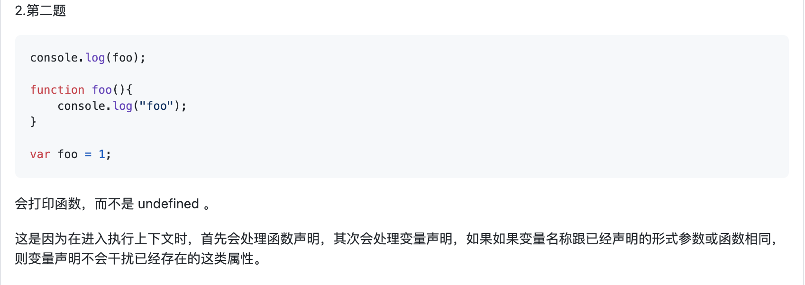
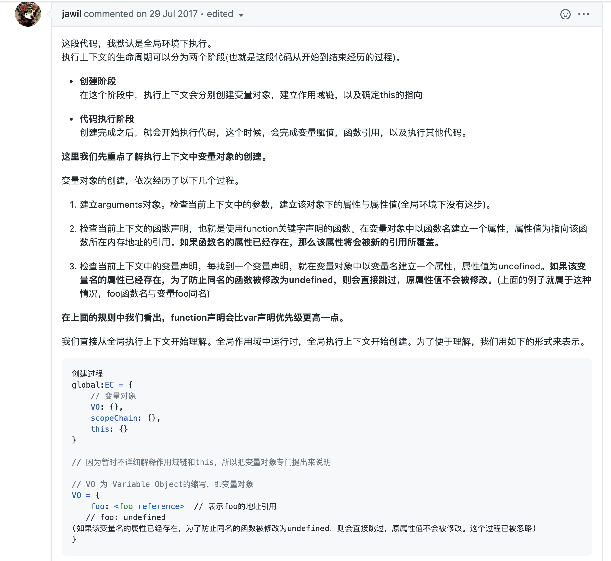
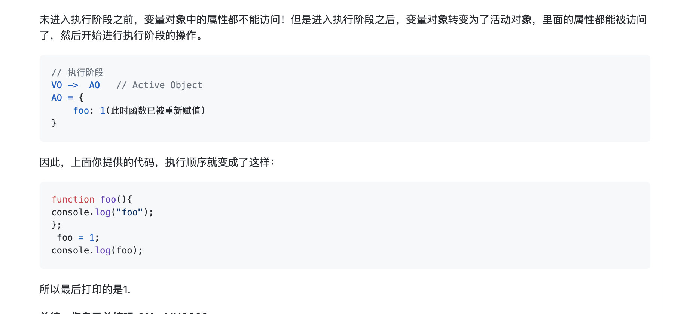
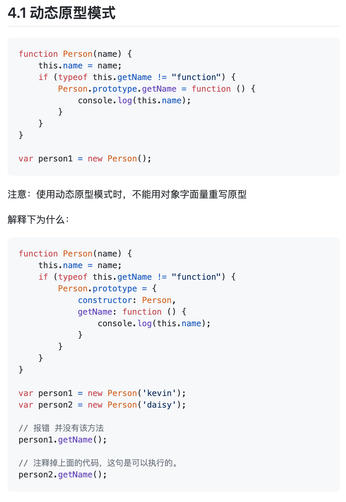
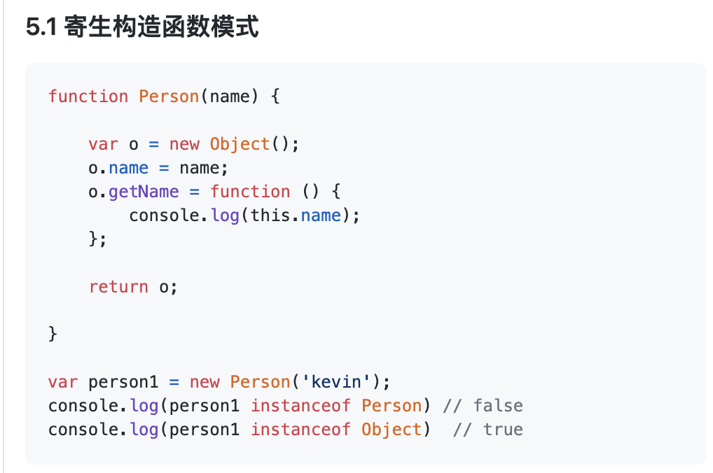

### js深入系列

- [x] [JavaScript深入之从原型到原型链](https://github.com/mqyqingfeng/Blog/issues/2)

- [x] [JavaScript深入之词法作用域和动态作用域](https://github.com/mqyqingfeng/Blog/issues/3)

- [x] [JavaScript深入之执行上下文栈](https://github.com/mqyqingfeng/Blog/issues/4)

- [x] [JavaScript深入之变量对象](https://github.com/mqyqingfeng/Blog/issues/5)
  执行上下文的组成、生命周期、变量对象的创建、变量对象向活动对象的转变

  

  
  
  

- [x] [JavaScript深入之作用域链](https://github.com/mqyqingfeng/Blog/issues/6)

- [x] [JavaScript深入之从ECMAScript规范解读this](https://github.com/mqyqingfeng/Blog/issues/7)（有时间要去看看ECMAScript 5.1 规范http://yanhaijing.com/es5/#160，结合规范理解this）

- [x] [JavaScript深入之执行上下文](https://github.com/mqyqingfeng/Blog/issues/8)(理顺执行上下文栈和执行上下文的具体变化过程)

- [x] [JavaScript深入之闭包](https://github.com/mqyqingfeng/Blog/issues/9)

- [ ] [JavaScript深入之参数按值传递](https://github.com/mqyqingfeng/Blog/issues/10)

- [x] [JavaScript深入之call和apply的模拟实现](https://github.com/mqyqingfeng/Blog/issues/11)

- [x] [JavaScript深入之bind的模拟实现](https://github.com/mqyqingfeng/Blog/issues/12)

- [ ] [JavaScript深入之new的模拟实现](https://github.com/mqyqingfeng/Blog/issues/13)

- [ ] [JavaScript深入之类数组对象与arguments](https://github.com/mqyqingfeng/Blog/issues/14)

- [x] [JavaScript深入之创建对象的多种方式以及优缺点](https://github.com/mqyqingfeng/Blog/issues/15)
  下面这两个模式注意结合new的底层实现分析
  
  

- [x] [JavaScript深入之继承的多种方式以及优缺点](https://github.com/mqyqingfeng/Blog/issues/16)

- [ ] [JavaScript深入系列15篇正式完结！](https://github.com/mqyqingfeng/Blog/issues/17)

- [ ] [JavaScript深入之浮点数精度](https://github.com/mqyqingfeng/Blog/issues/155)

- [ ] [JavaScript深入之头疼的类型转换(上)](https://github.com/mqyqingfeng/Blog/issues/159)

- [ ] [JavaScript深入之头疼的类型转换(下)](https://github.com/mqyqingfeng/Blog/issues/164)

### ES6

前提：了解以下内容的基本使用https://es6.ruanyifeng.com/，下面的内容不是es6的基础教程

- [ ] [ES6 系列之 let 和 const](https://github.com/mqyqingfeng/Blog/issues/82)
- [ ] [ES6 系列之模板字符串](https://github.com/mqyqingfeng/Blog/issues/84)
- [ ] [ES6 系列之箭头函数](https://github.com/mqyqingfeng/Blog/issues/85)
- [ ] [ES6 系列之模拟实现 Symbol 类型](https://github.com/mqyqingfeng/Blog/issues/87)
- [ ] [ES6 系列之迭代器与 for of](https://github.com/mqyqingfeng/Blog/issues/90)
- [ ] [ES6 系列之模拟实现一个 Set 数据结构](https://github.com/mqyqingfeng/Blog/issues/91)
- [ ] [ES6 系列之 WeakMap](https://github.com/mqyqingfeng/Blog/issues/92)
- [ ] [ES6 系列之我们来聊聊 Promise](https://github.com/mqyqingfeng/Blog/issues/98)
- [x] [ES6 系列之 Generator 的自动执行](https://github.com/mqyqingfeng/Blog/issues/99)(看完阮一峰的Iterator和generator，看这个练习一下)
- [ ] [ES6 系列之我们来聊聊 Async](https://github.com/mqyqingfeng/Blog/issues/100)
- [ ] [ES6 系列之异步处理实战](https://github.com/mqyqingfeng/Blog/issues/101)
- [ ] [ES6 系列之 Babel 将 Generator 编译成了什么样子](https://github.com/mqyqingfeng/Blog/issues/102)
- [ ] [ES6 系列之 Babel 将 Async 编译成了什么样子](https://github.com/mqyqingfeng/Blog/issues/103)
- [ ] [ES6 系列之 Babel 是如何编译 Class 的(上)](https://github.com/mqyqingfeng/Blog/issues/105)
- [ ] [ES6 系列之 Babel 是如何编译 Class 的(下)](https://github.com/mqyqingfeng/Blog/issues/106)
- [ ] [ES6 系列之 defineProperty 与 proxy](https://github.com/mqyqingfeng/Blog/issues/107)
- [ ] [ES6 系列之模块加载方案](https://github.com/mqyqingfeng/Blog/issues/108)
- [ ] [ES6 系列之我们来聊聊装饰器](https://github.com/mqyqingfeng/Blog/issues/109)
- [ ] [ES6 系列之私有变量的实现](https://github.com/mqyqingfeng/Blog/issues/110)
- [ ] [ES6 完全使用手册](https://github.com/mqyqingfeng/Blog/issues/111)