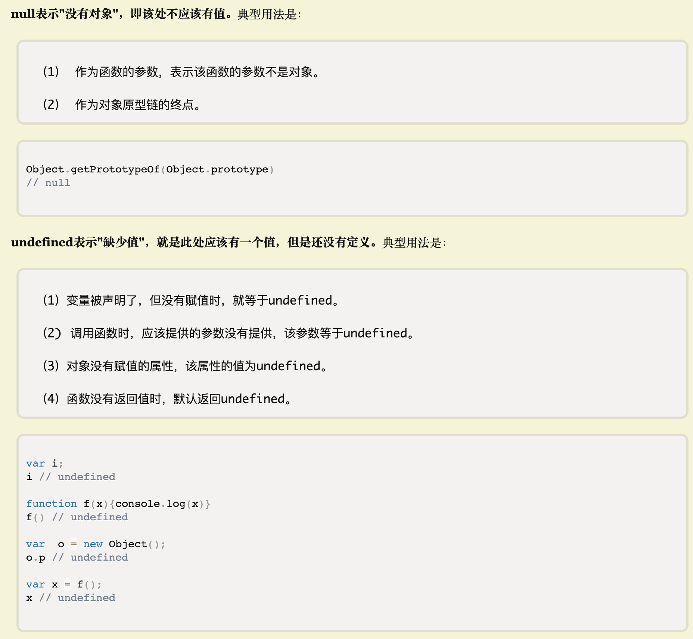

- [ ] 运算符优先级：https://developer.mozilla.org/zh-CN/docs/Web/JavaScript/Reference/Operators/Operator_Precedence
- [ ] 严格模式和非严格模式
- [ ] null和undefined的区别：http://www.ruanyifeng.com/blog/2014/03/undefined-vs-null.html
  
- [ ] typeof：undefined number string boolean object function
- [ ] ajax
- [ ] 常见的api：
  - Object.getPrototypeOf()：返回指定对象的原型
  - instanceof运算符：用于检测构造函数的 `prototype` 属性是否出现在某个实例对象的原型链上。
  - prototypeObj.isPrototypeOf(object)
  - Object.defineProperty(非常重要)
  - Object.prototype.hasOwnProperty()
  - Object.getOwnPropertySymbols()
- [ ] DOM操作
- [ ] 事件（冒泡 捕获 委托）
- [ ] location
  - window.location.protocol
  - window.location.host
  - window.location.hostname
  - window.location.port
  - window.location.pathname
  - window.location.search
  - window.location.hash
- [ ] 

冴羽的博客

你不知道的javascript

JavaScript权威指南

红宝书

